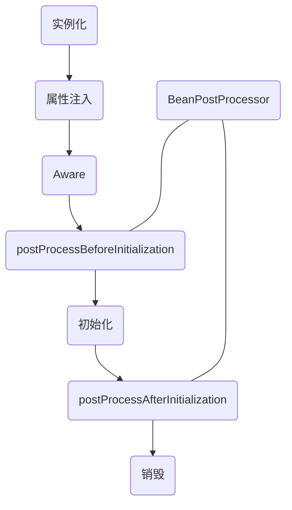

## 介绍

Mirage 的核心框架，其中包含了以下基础功能

* [应用对象工厂](#应用对象工厂)
* [应用环境配置](#应用环境配置)
* [应用事件系统](#应用事件系统)

## 快速启动

在你的pom中添加以下依赖

```xml
<dependency>
    <groupId>cc.shacocloud</groupId>
    <artifactId>mirage-starter</artifactId>
</dependency>
```

::: code-tabs#language

@tab kotlin

```kotlin
@MirageBootApplication
class Application

fun main(args: Array<String>) {
    MirageApplication.run(Application::class.java, *args)
}
```

@tab java

```java
@MirageBootApplication
public class Application {

    public static void main(String[] args) {
        MirageApplication.run(Application.class,args);
    }

}
```

:::

## 应用对象工厂

应用对象工厂，即 IOC（控制反转）+ DI（依赖注入）

即对象的创建，依赖注入的过程都将由对象工厂来完成，那么开发需要做的是在需要对象工厂管理的对象上使用指定注解来标识，这样在应用启动时，会自动扫描这些类并且加载到工厂中进行管理

那么如果定义一个工厂对象呢？，请继续往下看：

### 定义工厂对象

使用 `@Component` 注解标识在对象上，即可标识为一个工厂对象。

如果未显式的定义对象的名称，则默认为类名首字母小写驼峰命名法，如果需要显示的定义使用 `@Component(value="对象名称")`

示例：

::: code-tabs#language

@tab kotlin

```kotlin
@Slf4j
@Component(lazy = false)
class TestComponent : InitializingBean {

    override fun init() {
        log.info("testComponent 初始化成功：${this}")
    }
}
```

@tab java

```java
@Slf4j
@Component(lazy = false)
public class TestComponent implements InitializingBean {

    @Override
    public void init() throws Exception {
        log.info("testComponent 初始化成功：{}", this);
    }
}

```

:::

使用 `@Configuration` 注解标识在对象上，那么该对象将被标识为一个配置工厂对象，在该对象中使用 `@Bean` 标识方法来表示这是一个工厂对象方法。

如果未显示的定义对象的名称则使用方法名作为对象名称，如果需要显示的定义使用 `@Bean(value="对象名称")`

示例：

::: code-tabs#language

@tab kotlin

```kotlin
@Configuration
class TestConfiguration {

    @Slf4j
    class TestBean : InitializingBean {
        override fun init() {
            log.info("testBean 初始化成功：${this}")
        }
    }

    @Bean(lazy = false)
    fun testBean(): TestBean {
        return TestBean()
    }
}
```

@tab java

```java
@Configuration
public class TestConfiguration {

    @Slf4j
    public static class TestBean implements InitializingBean {

        @Override
        public void init() throws Exception {
            log.info("testBean 初始化成功：{}", this);
        }
    }

    @Bean(lazy = false)
    public TestBean testBean() {
        return new TestBean();
    }
}
```

:::

::: info 懒加载
默认情况下使用 `@Component` 或 `@Bean` 注解标识的对象都是懒加载的，即什么时候第一次使用则什么时候加载，如果不是懒加载对象，那么将在应用工厂所有的类型扫描完成后，进行实例化。
:::

### 对象生命周期

::: info 作用域

这里值得一提的是，被对象工厂管理的实例，它的作用域一定是单例的，对于 **原型对象**对象工厂每次都会创建一个对象，创建好后将不会继续管理后续的生命周期，即 对象工厂不会参与原型对象的销毁过程

默认情况下对象实例都是 `@Singleton`的，如果需要原型对象则在定义工厂对象时，额外使用 `@Prototype`注解标识

:::




通过以上的生命周期图中可以看出在对象创建的过程中定义了一些回调方法，用于参与对象的创建。

#### 实例化

对象的实例化是通过构造函数完成的，那么如果该对象只存在一个构造函数，则使用它，如果该对象存在多个构造函数，那么存在一个判断逻辑，**构造函数必须的`public`的且必须标识 `@Inject` 或者 `@Autowired`注解**，如果匹配到多个那么将抛出例外！

::: warning 循环依赖
请注意，当前版本不尝试解决任何形态的循环注入问题，即不可以 A实例是B实例的依赖性，同时B实例又是A实例的依赖项。这样的情况将导致获取该实例对象时抛出`BeanException`异常！
:::

#### 属性注入

属性注入分为两种，对象属性注入和对象方法注入。

对象属性注入条件：

* 非静态属性
* 非 final  属性
* 属性上使用 `@Inject` 或 `@Autowired`注解

对象方法注入条件：

* 非静态方法
* public 标识的方法
* 方法是上使用 `@Inject` 或 `@Autowired`注解
* 非被重写的方法

#### 初始化

如果对象实现了接口 `InitializingBean`，那么在初始化这个生命周期时，将回调 `InitializingBean#init` 方法，可以在该方法中进行一些对象初始化逻辑

#### Aware

`Aware`即感知，在对象创建的过程中，可以实现 `Aware` 定义一些子接口，用于获取特定的对象实例。

* BeanFactoryAware
  对象工厂感知接口，可以获取当前应用的工厂对象 `BeanFactory`
* BeanNameAware
  对象名称感知接口，可以获取当前对象实例在对象工厂中的名称
* EnvironmentAware
  环境对象感知接口，可以获取当前应用的环境配置对象 `Environment`
* ApplicationContextAware
  应用上下文感知接口，可以获取当前应用的上下文对象 `ApplicationContext`

#### BeanPostProcessor

`BeanPostProcessor`即对象的后置处理器，在工厂对象实例初始化前和初始化后可以做一些特定的操作。

比如：环境配置注解 `ConfigurationProperties` 的实现就是依赖 `BeanPostProcessor` 完成的，在实例初始化前判断该对象类是否标识 `ConfigurationProperties`注解，如果标识则进行配置属性绑定。

您也可以基于 `BeanPostProcessor` 的机制做一些特定的操作，比如生成代理对象？

::: warning AOP

需要注意的是：mirage 目前不支持aop，后续也不考虑支持，因为AOP只会给项目带来更高的复杂度，更高的维护成本，而它带来的收益仅仅是可以快速的打补丁然后上线。

我们希望开发者在开发的同时不要只想着业务的完成，我们建议通过一些拓展点的方式来提高系统的可维护性，这就需要开发者了解一些常用的设计模式，这里附上链接：https://refactoringguru.cn/design-patterns

:::

:::info

mirage 的对象工厂，完全兼容 JSR 303的依赖注入规范

:::

## 应用环境配置


## 应用事件系统
