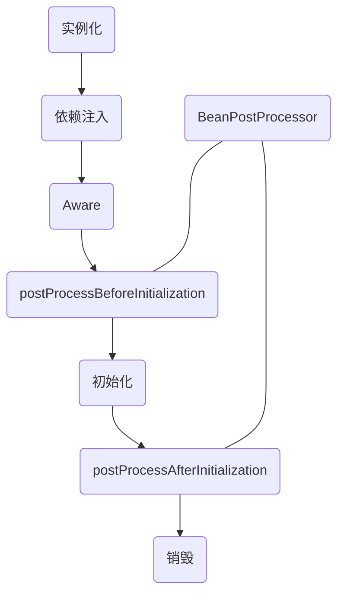
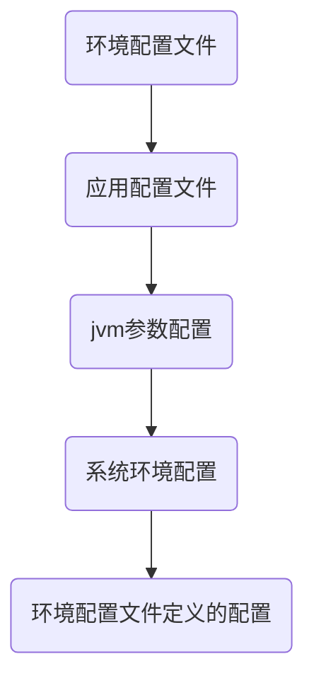

## 介绍

Mirage 的核心框架，其中包含了以下基础功能

* [应用对象工厂](#应用对象工厂)
* [应用环境配置](#应用环境配置)
* [应用事件系统](#应用事件系统)

## 快速启动

在你的pom中添加以下依赖

```xml
<dependency>
    <groupId>cc.shacocloud</groupId>
    <artifactId>mirage-starter</artifactId>
</dependency>
```

::: code-tabs#language

@tab kotlin

```kotlin
@MirageBootApplication
class Application

fun main(args: Array<String>) {
    MirageApplication.run(Application::class.java, *args)
}
```

@tab java

```java
@MirageBootApplication
public class Application {

    public static void main(String[] args) {
        MirageApplication.run(Application.class,args);
    }

}
```

:::

## 应用对象工厂

::: info

mirage 的对象工厂，完全兼容 JSR 303的依赖注入规范

:::

应用对象工厂，即 IOC（控制反转）+ DI（依赖注入）

即对象的创建，依赖注入的过程都将由对象工厂来完成，那么开发需要做的是在需要对象工厂管理的对象上使用指定注解来标识，这样在应用启动时，会自动扫描这些类并且加载到工厂中进行管理

那么如果定义一个工厂对象呢？，请继续往下看：

### 定义工厂对象

使用 `@Component` 注解标识在对象上，即可标识为一个工厂对象。

如果未显式的定义对象的名称，则默认为类名首字母小写驼峰命名法，如果需要显示的定义使用 `@Component(value="对象名称")`

示例：

::: code-tabs#language

@tab kotlin

```kotlin
@Slf4j
@Component(lazy = false)
class TestComponent : InitializingBean {

    override fun init() {
        log.info("testComponent 初始化成功：${this}")
    }
}
```

@tab java

```java
@Slf4j
@Component(lazy = false)
public class TestComponent implements InitializingBean {

    @Override
    public void init() throws Exception {
        log.info("testComponent 初始化成功：{}", this);
    }
}

```

:::

使用 `@Configuration` 注解标识在对象上，那么该对象将被标识为一个配置工厂对象，在该对象中使用 `@Bean` 标识方法来表示这是一个工厂对象方法。

如果未显示的定义对象的名称则使用方法名作为对象名称，如果需要显示的定义使用 `@Bean(value="对象名称")`

示例：

::: code-tabs#language

@tab kotlin

```kotlin
@Configuration
class TestConfiguration {

    @Slf4j
    class TestBean : InitializingBean {
        override fun init() {
            log.info("testBean 初始化成功：${this}")
        }
    }

    @Bean(lazy = false)
    fun testBean(): TestBean {
        return TestBean()
    }
}
```

@tab java

```java
@Configuration
public class TestConfiguration {

    @Slf4j
    public static class TestBean implements InitializingBean {

        @Override
        public void init() throws Exception {
            log.info("testBean 初始化成功：{}", this);
        }
    }

    @Bean(lazy = false)
    public TestBean testBean() {
        return new TestBean();
    }
}
```

:::

::: info 懒加载
默认情况下工厂对象都是懒加载的，如果需要定义非懒加载对象可以通过 `@Component(lazy = false)` 或者 `@Bean(lazy = false)` 来定义，非懒加载对象将在应用工厂所有的类型扫描完成后，进行实例化。
:::

### 工厂对象扫描

默认情况下，优先扫描**启动类的包路径及其子路径中所有定义的工厂对象**，接着将加载 [SPI 机制](#spi-机制) 中的自动装配对象，如果扫描到对象标识着 `@ComponentScan` 注解，则基于该注解定义的路径继续扫描。

### 对象生命周期

::: info 作用域

这里值得一提的是，被对象工厂管理的实例，它的作用域一定是单例的，对于 **原型对象**对象，即：工厂每次都会创建一个对象，创建好后将不会继续管理后续的生命周期，交由使用者进行管理。

如果需要定义原型对象则需要额外使用 `@Prototype`注解标识

:::



通过以上的生命周期图中可以看出在对象创建的过程中定义了一些回调方法，用于参与对象的创建。

#### 实例化

对象的实例化是通过构造函数完成的，那么如果该对象只存在一个构造函数（无论是否私有），则使用它，如果该对象存在多个构造函数，那么存在一个判断逻辑，**构造函数必须的`public`的且必须标识 `@Inject` 或者 `@Autowired`注解**，如果匹配到多个那么将抛出例外！

::: warning 循环依赖
请注意，当前版本不尝试解决任何形式的循环注入问题，即不可以 A实例是B实例的依赖性，同时B实例又是A实例的依赖项。这样的情况将导致获取该实例对象时抛出`BeanException`异常！
:::

#### 依赖注入

依赖注入分为两种，对象属性注入和对象方法注入。

对象属性注入条件：

* 非静态属性
* 非 final  属性
* 属性上使用 `@Inject` 或 `@Autowired`注解

对象方法注入条件：

* 非静态方法
* public 标识的方法
* 方法是上使用 `@Inject` 或 `@Autowired`注解
* 非被重写的方法

::: info 依赖名称注入

默认情况下依赖注入使用类型注入，如果出现多个匹配的类型将抛出例外！

如果需要通过名称进行注入，则需要使用 `@Named`注解定义注入对象的名称。

如果你想为指定对象标识一个类型，通过它来完成依赖注入，可以参考 `jakarta.inject.Qualifier`，通过自定义注解的方式匹配工厂对象

:::

#### 初始化

如果对象实现了接口 `InitializingBean`，那么在初始化这个生命周期时，将回调 `InitializingBean#init` 方法，可以在该方法中进行一些对象初始化逻辑

#### Aware

`Aware`即感知，在对象创建的过程中，可以实现 `Aware` 定义一些子接口，用于获取特定的对象实例。

* BeanFactoryAware
  对象工厂感知接口，可以获取当前应用的工厂对象 `BeanFactory`
* BeanNameAware
  对象名称感知接口，可以获取当前对象实例在对象工厂中的名称
* EnvironmentAware
  环境对象感知接口，可以获取当前应用的环境配置对象 `Environment`
* ApplicationContextAware
  应用上下文感知接口，可以获取当前应用的上下文对象 `ApplicationContext`

#### BeanPostProcessor

`BeanPostProcessor`即对象的后置处理器，在工厂对象实例初始化前和初始化后可以做一些特定的操作。

比如：环境配置注解 `ConfigurationProperties` 的实现就是依赖 `BeanPostProcessor` 完成的，在实例初始化前判断该对象类是否标识 `ConfigurationProperties`注解，如果标识则进行配置属性绑定。

您也可以基于 `BeanPostProcessor` 的机制做一些特定的操作，比如生成代理对象？

::: warning AOP

需要注意的是：mirage 不支持aop，也不建议您使用，我们认为AOP只会给项目带来更高的复杂度和更高的维护成本以及更差的性能。

我们希望通过一些拓展点的方式来提高系统的可维护性，这就需要开发者了解一些常用的设计模式，这里附上链接：https://refactoringguru.cn/design-patterns

:::

::: info

`BeanPostProcessor` 的对象配置基于 [SPI 机制](#spi-机制) 实现，也被视为对象工厂中的对象，在此我们建议 `BeanPostProcessor` 不要存在对象依赖，因为这将导致这些依赖对象的创建时机被提到 `BeanPostProcessor` 之前

:::

### 工厂对象覆盖

mirage 使用约定大于配置的方式构建应用，那么在一些场景上，可能不太满足，这个时候需要将原有对象排除使用自定义的注入对象，为此我们提供了以下两种方式

#### 条件覆盖

条件覆盖通过在定义工厂对象上标识 `@Conditional` 注解的方式来完成，`@Conditional#value` 属性为 `Condition`接口类型，实现该接口定义工厂对象条件覆盖的具体逻辑即可。

需要注意的是 `Condition` 的实现对象，必须提供一个无参构造函数，否则将无法初始化该对象。

mirage 内部提供了一些 `@Conditional` 的实现，可以使用以下注解

* `@ConditionalOnClass` ：当存在指定类时加载
* `@ConditionalOnMissingBean`：当不存在指定的对象，那么将当前对象添加到对象工厂中

#### 对象排除

对象排除一般来说不建议使用，我们更加建议通过条件覆盖的方式。

如果必须要使用对象排除，则需要使用 `@ExcludeComponent` 注解定义排除的对象类型或者对象名称，也可以通过 [SPI 机制](#spi-机制) 排除指定类型

::: warning 排除对象

需要注意的是：如果该对象已经完成了初始化，那么该对象就无法被排除

:::

### SPI 机制

mirage 的 SPI 机制通过在资源目录下定义 ` META-INF\mirageFactories.properties ` 配置文件的方式，以下是一份参考

```properties
# 自动装配的类
factories.autoConfiguration=\
  cc.shacocloud.mirage.context.MirageVertxConfiguration,\
  cc.shacocloud.mirage.context.MirageVertxProperties
# 排除的组件
factories.excludeComponent=
```

如上所示，通过全类名的方式定义，多个英文半角逗号分割

* factories.autoConfiguration：为自动装配的一些类
* factories.excludeComponent：为需要排除的对象类型

## 应用环境配置

系统的环境配置提供了2个内置的配置文件，路径都是相对于资源目录，文件不存在则不加载

* 环境配置文件：`environment.yaml`
  用于定义环境配置信息，可以在其中配置不同环境读取的配置文件
* 应用配置文件：`application.yaml`
  用于定义应用配置信息，内置配置文件。即：无论环境配置中是否定义，该文件都会加载

:::info

系统支持3种文件格式，分别是 yaml，json，properties，所以上面的2个配置文件使用 `environment.json`，`environment.properties`，`application.json`，`application.properties` 也可以

:::

### 环境配置文件

在环境配置文件中可以定义不同环境下加载的配置文件，示例如下：

```yaml
mirage:
  environment:
    # 激活的环境
    active: ${mirage_environment_active:dev}
    # 配置文件刷新间隔，默认是5秒
    refresh: 5000
    # 环境配置集
    profiles:
     # 环境名称和 mirage.environment.active 对应
      - id: dev
      # 环境存储信息
        stores:
          # classpath:// 表示类路径加载
          - path: classpath://application-dev.yaml
          # https:// 表示远端加载
          - path: https://gitee.com/lulihu/mirage-demo/raw/master/mirage-kotlin-demo/src/main/resources/application-dev1.yaml
            headers:
              client: mirage demo
            # file:// 表示文件系统加载，绝对路径
          - path: file:///opt/app/application-dev2.yaml
            # optional 如果为 true 表示为可选的，即：文件不存在则忽略，默认为 false 不存在将抛出例外
            optional: true
      - id: uat
        stores:
          - path: classpath://application-uat.yaml
          - path: https://gitee.com/lulihu/mirage-demo/raw/master/mirage-kotlin-demo/src/main/resources/application-uat1.yaml
            headers:
              client: mirage demo
          - path: file:///opt/app/application-uat2.yaml
            optional: true
```

从以上配置信息示例可以看出，目前系统支持3种配置文件加载方式，分别是

* 类路径加载：使用 `classpath://` 作为路径前缀
* 文件系统加载：使用 `file://` 作为路径前缀
* 远端请求加载：使用 `http://`或者`https://` 作为路径前缀，如果使用该方式可以通过 `headers`属性配置请求时携带的自定义头部信息

如果指定配置路径文件有可能不存在，那么可以将 `optional` 属性定义 true，表示为文件不存在则忽略，默认为 false 不存在将抛出例外

::: info

在所有的配置文件信息中，字符串的内容都会被当做表达式内容进行表达式替换，比如：`${mirage_environment_active:dev}` 表示为 如果 mirage_environment_active 配置键的值存在则使用，否则使用 dev 作为值

:::

### 配置文件加载顺序



配置的顺序非常重要， 因为它定义了覆盖顺序。对于冲突的key， 后声明的配置中心会覆盖之前的。我们举个例子。 我们有两个配置：

- `A` 提供 `{a:value, b:1}` 配置
- `B` 提供 `{a:value2, c:2}` 配置

以 A，B 的顺序声明配置，最终配置应该为： `{a:value2, b:1, c:2}` 

如果您将声明的顺序反过来（B，A），那么您会得到 `{a:value, b:1, c:2}` 

### 配置注入

系统提供了一下注解，用于注入配置信息到指定的对象中

::: info

环境配置每隔 `mirage.environment.refresh`重新加载一次配置信息，如果配置发生了变更将发布应用事件 `EnvironmentChangeEvent` ，且所有的配置对象都将被重新注入新的值

:::

#### @ConfigurationProperties

配置属性注解，在对象类上使用了该注解后，该对象的所有**Set方法**都将被视为配置属性的注入点。

示例：

::: code-tabs#language

@tab kotlin

```kotlin
@ConfigurationProperties(prefix = "mirage.demo")
class MirageDemoProperties {

    var dev: String = ""
    var dev1: String = ""

}
```

@tab java

```java
@Setter
@Getter
@NoArgsConstructor
@ConfigurationProperties(prefix = "mirage.demo")
public class MirageDemoProperties {

    private String dev;
    private String dev1;

}
```

:::

#### @EnvValue

环境值注解，使用其定义在工厂对象的属性或者**Set方法**上，即可为这个工厂对象注入环境配置信息。

示例：

属性注入

::: code-tabs#language

@tab kotlin

```kotlin
@Component
class MirageDemoBean {

    @EnvValue("\${mirage.demo.dev1}")
    private var dev1: String = ""

}
```

@tab java

```java
@Component
public class MirageDemoBean {

   @EnvValue("${mirage.demo.dev1}")
   private String dev1;

}
```

:::

方法注入

::: code-tabs#language

@tab kotlin

```kotlin
@Component
class MirageDemoBean {
    
    private lateinit var dev1: String

    @EnvValue("\${mirage.demo.dev1}")
    fun setDev1(dev1: String) {
        this.dev1 = dev1;
    }

}
```

@tab java

```java
@Component
public class MirageDemoBean {

   private String dev1;

   @EnvValue("${mirage.demo.dev1}")
   public void setDev1(String dev1){
        this.dev1 = dev1;
   }
}
```

:::

::: warning

注意：set 方法必须满足以下几个条件

方法名称必须以 set 为前缀，且 set 的下一个字符大写

方法必须只有一个入参

方法的返回结果必须为 void 或者 Void

:::

## 应用事件系统

当应用运行到某个阶段事件，将会发出应用事件，工厂对象通过实现 `ApplicationListener` 来定义监听的事件，当该事件发生时将会触发 `ApplicationListener#onApplicationEvent`方法。

示例：

::: code-tabs#language

@tab kotlin

```kotlin
@Slf4j
@Component
class MirageDemoEventBean : CoroutineApplicationListener<EnvironmentChangeEvent> {

    override suspend fun doApplicationEvent(event: EnvironmentChangeEvent) {
        log.info("配置发生变更...")
    }

}
```

@tab java

```java
@Slf4j
@Component
public class MirageDemoEventBean implements ApplicationListener<EnvironmentChangeEvent> {

    @Override
    public Future<Void> onApplicationEvent(EnvironmentChangeEvent event) {
        log.info("配置发生变更...");
        return Future.succeededFuture();
    }
}
```

:::

### 自定义事件

示例：

::: code-tabs#language

@tab kotlin

```kotlin
// 定义自定义事件对象
class CustomEvent : ApplicationEvent {
}

// 发布事件
MirageHolder.publishEvent(CustomEvent())
```

@tab java

```java
// 定义自定义事件对象
public class CustomEvent implements ApplicationEvent {
}

// 发布事件
MirageHolder.publishEvent(new CustomEvent())
```

:::

所有的事件对象必须继承 `ApplicationEvent` 接口，以表示自己是一个事件对象
